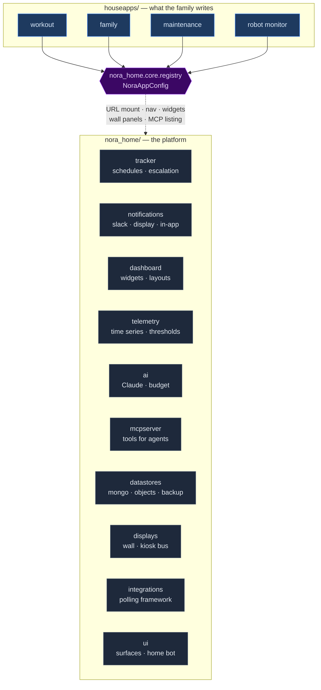
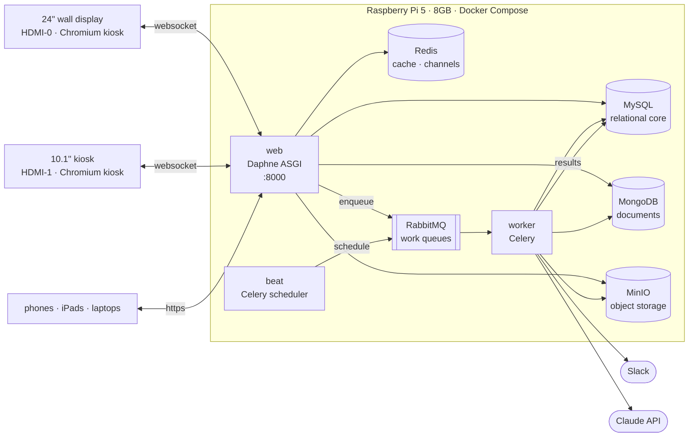
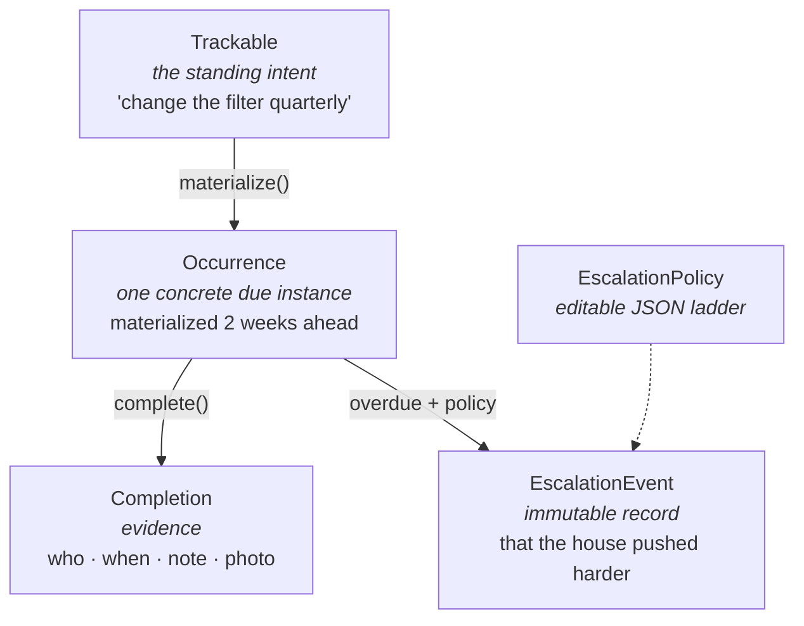
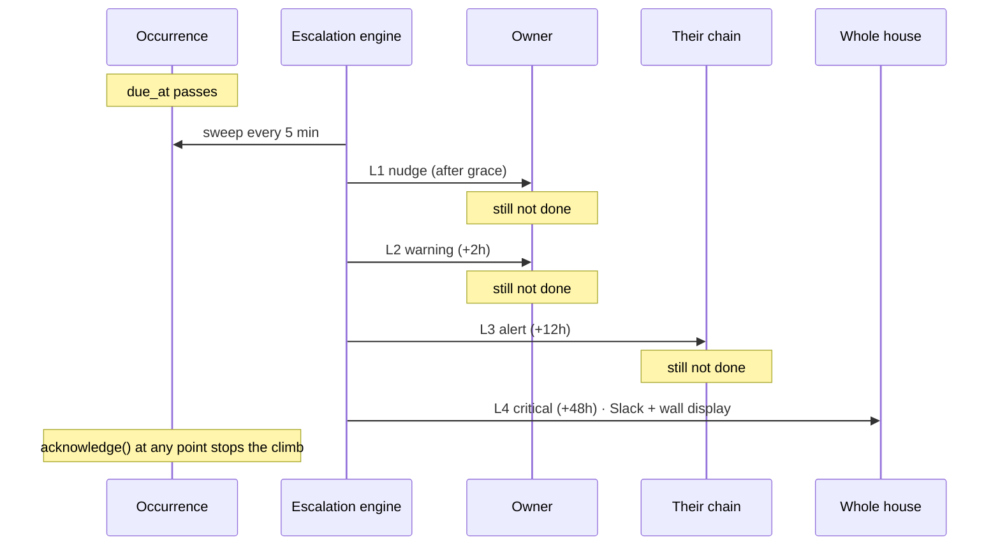
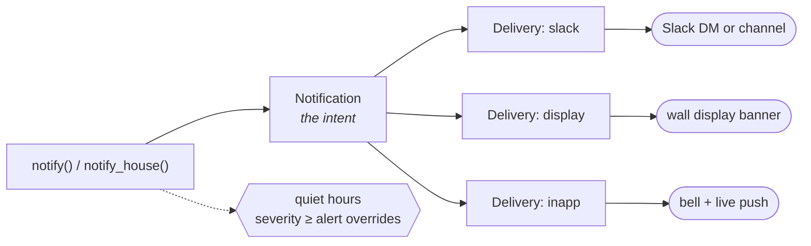
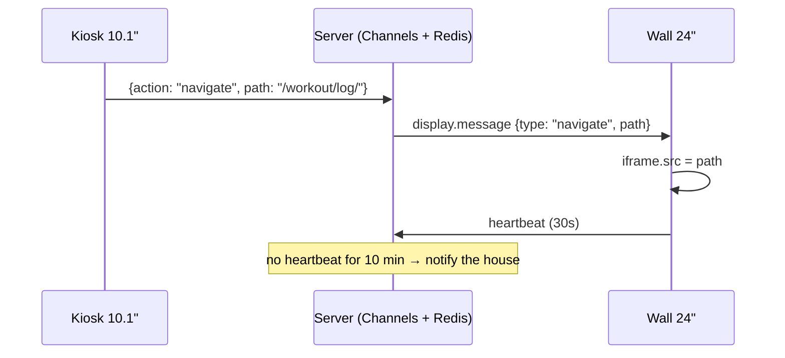
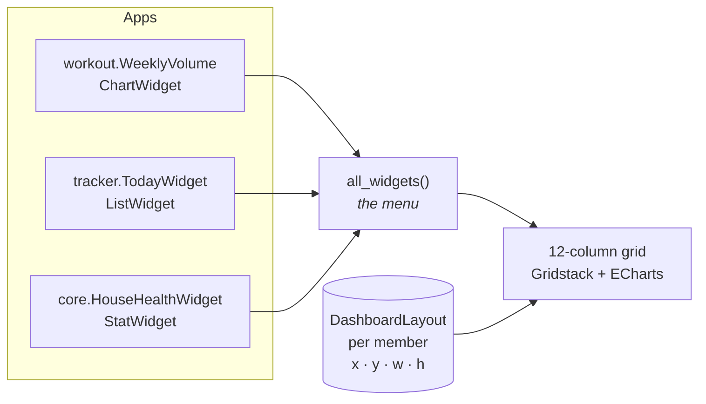
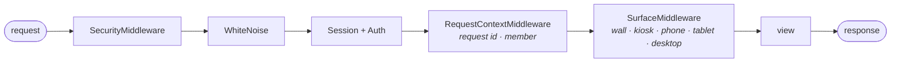

# Architecture

How Nora Home is put together, and why. Diagrams are Mermaid — GitHub, VS Code, and
most Markdown viewers render them inline.

> **Nora Home is not Nora.** Nora is the family's robot, a separate machine with its
> own repository. Nora Home is the house system it lives alongside. They meet at
> exactly two places, both listed under [Boundaries](#boundaries).

---

## 1. The shape of the thing

Nora Home is a **platform**, not an application. The base system provides plumbing;
the apps the family writes provide the value. Everything below the dashed line is
what a house app gets for free.



**The contract is one class.** A house app subclasses `NoraAppConfig` in its
`apps.py` and declares a slug, a category, and which widgets and wall panels it
offers. From that the platform derives its URL, its nav entry, its place on the home
screen and the wall, and its presence in the MCP tool listing. Nothing else is wired
by hand — `config/urls.py` is never edited to add an app.

---

## 2. Processes and data stores



### Why each store

| Store | Holds | Chosen because |
|---|---|---|
| **MySQL** | Members, trackables, occurrences, notifications, telemetry, layouts | Anything the tracker or escalation engine joins across. Relational, transactional, migratable. |
| **MongoDB** | Journals, AI transcripts, raw integration payloads, sensor bursts | Shapes that change as ideas change, without a migration each time. **Optional** — the house runs degraded, not broken, without it. |
| **Redis** | Cache, Channels layer, rate limits | Fast, ephemeral, and already needed for websockets. |
| **RabbitMQ** | Celery work queues | Durable queues and real routing, so a runaway app task cannot delay an escalation. Collapsible to Redis on a laptop via `NORA_HOME_BROKER_USE_REDIS=1`. |
| **MinIO** | Photos, exports, backups, robot recordings | S3-compatible and runs on the Pi. Falls back to local disk when `NORA_HOME_S3_ENABLED=0`. |

### Queue separation

Five queues, so one app's slowness is never another's outage:

| Queue | Carries | Who may use it |
|---|---|---|
| `platform` | Health snapshots, rollups, display rotation, backups | Platform only |
| `alerts` | Notification delivery, escalation sweeps | Platform only |
| `apps` | Everything a house app schedules | **House apps — use this** |
| `ai` | Claude calls | Anyone |
| `integrations` | Outside-world polling | Integration framework |

---

## 3. The tracker and the escalation ladder

The spine of the system, and the reason it is not a todo list.



Three layers, kept separate on purpose:

- **Trackable** — the standing intent. Belongs to a person and to an app.
- **Occurrence** — one concrete due instance. **Written ahead of time, not computed
  on read.** That is what makes "what did I miss last March" answerable and gives
  escalation state somewhere to live.
- **Completion** — evidence, kept separately so history survives an occurrence being
  reopened.

### The ladder



`EscalationPolicy.levels` is JSON, so the ladder is editable in the admin without a
deploy. Three ship by default: **House default**, **Gentle** (for habits), and
**Safety critical** (medication, alarms — 15 minutes to all adults).

---

## 4. Notifications

Intent and delivery are separate records. That is what makes "did anyone actually
see this?" answerable.



Each `Delivery` records attempts, errors, timestamps, and the provider's own
reference. Failures retry on a sweep; permanent ones stay recorded rather than
disappearing.

---

## 5. The two screens

The Pi drives both HDMI outputs. The 24" wall shows the real app — the same
`/home/` a phone or laptop would render, inside a thin iframe shell
(`displays/wall_live.html`) — full-size, for anyone in the room to read, but
with no touch or mouse of its own. The 10.1" kiosk is its **remote
control**: a fixed grid of buttons, never the app itself. Commands travel
through the server (Channels + Redis), not directly between the two screens.



Every registered house app gets one kiosk button for free, switching the
wall to that app's front page. An app that declares
`nora_kiosk_controls` on its `NoraAppConfig` (see `DEVELOPMENT.md`) gets a
whole extra button screen on the kiosk — tapping any of its buttons still
just sends a `navigate` command, to that app's own page instead of its
front page. The wall's outer page and its websocket never reload on
navigation, only the iframe's `src` changes, so a burst of kiosk taps
doesn't cost a reconnect each time. If the socket dies, commands fall back
to a plain HTTP POST (`displays/command/`) so the kiosk still works.

A `Settings` page (`core:settings`, in the URL map below) holds house-wide
configuration — `HouseSetting`, a generic cached key/value store that
already existed but had no UI reading or writing it until now. First
setting: a schedule for when the wall display powers off. Django decides
on/off (`manage.py wall_power_state`, timezone-aware); a small host-side
script and systemd timer — outside Docker, since that's where the actual
X11 session and monitor live — poll it every 5 minutes and act with
`xset dpms force`.

---

## 6. The home screen

Each person arranges their own grid from widgets any app offers.



**Widgets return data, not HTML.** `ChartWidget.option()` returns an ECharts option
dict; the platform applies colour, type, and dark/light. That is what keeps a chart
written by one family member looking like a chart written by another.

Both libraries are **vendored into the repo**. The house must render with the
internet down, and the Pi must never run a build step.

---

## 7. Request path



`SurfaceMiddleware` names the surface server-side and stamps it on `<html>`, so CSS
responds without any viewport measuring in JavaScript. The wall gets three-metre
type and the kiosk gets thumb-sized targets from the same stylesheet.

---

## 8. Boundaries

Rules that keep the system able to lose a part without losing the whole.

| Boundary | Rule |
|---|---|
| **App ↔ app** | Never import another app's models. Use `nora_home.tracker.api`, `nora_home.notifications.api`, `nora_home.telemetry.api`, or a signal from `nora_home.core.signals`. |
| **App ↔ environment** | No app reads `os.environ`. Settings go in `config/settings/base.py` with a default. |
| **Secrets ↔ database** | Credentials live in `.env` only. A database dump shared for debugging carries no tokens. |
| **Failure ↔ blast radius** | A card that raises renders "unavailable". A broken house app is skipped at mount. A dead Mongo is *degraded*, not *down*. The wall display survives everything. |
| **Nora Home ↔ Nora (robot)** | Two touchpoints only: the robot may post to `/api/homebot/say/` to put a line on the house screens, and it may read the MCP tools with a scoped device token. Nothing else is shared. |

---

## 9. Layout on disk

```
config/                 Django project — settings/, celery, urls, asgi, wsgi
nora_home/              THE PLATFORM
  core/                 registry, base models, cards, health, audit, logging, API
  dashboard/            widget base classes, per-member layouts
  accounts/             HouseMember (AUTH_USER_MODEL), roles, escalation contacts
  notifications/        channels, delivery receipts
  tracker/              trackables, occurrences, scheduling, escalation engine
  ai/                   Claude client, model tiers, cost accounting
  mcpserver/            MCP tool registry, stdio server, HTTP transport
  datastores/           mongo, object storage, backup/restore
  displays/             wall + kiosk models, bus, consumers
  telemetry/            series, readings, rollups, thresholds
  integrations/         polling framework
  ui/                   surface detection, home bot, theme
houseapps/              WHAT THE FAMILY WRITES (example_habit is the reference)
templates/              platform templates
static/nora_home/       css, js, vendor
docker/ scripts/ docs/  entrypoint, provisioning, this folder
```

---

## 10. URL map

```
/                       → redirects to /home/
/home/                  the home dashboard (per-person widget grid)
/home/tracker/          the tracker
/home/alerts/           notifications
/home/displays/         wall + kiosk management
/home/displays/wall/    THE 24" SCREEN — iframe shell, shows real app pages remotely
/home/displays/kiosk/   THE 10.1" SCREEN — button remote, never the app itself
/home/ai/               assistant console
/home/measurements/     telemetry
/home/integrations/     integrations
/home/apps/             app directory
/home/system/           health and audit
/home/settings/         house-wide configuration (HouseSetting-backed)
/home/capabilities/     the capability sheet
/accounts/              switch (passwordless), profile, household
/api/                   platform API (device-token auth)
/mcp/                   MCP tools over HTTP
/admin/                 Django admin

/<app-slug>/            EVERY HOUSE APP — /habits/, /workout/, /family/ …
```

House apps mount at the root so each reads like its own site.
`RESERVED_SLUGS` in `nora_home/core/registry.py` stops an app claiming a platform
prefix.
